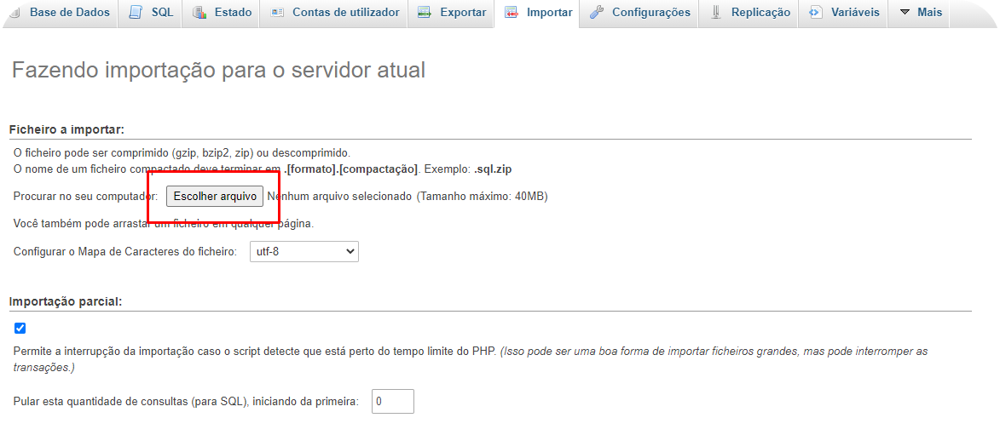

<h1 align="center" style="font-weight: 700"> 🏠 Cadê Minha Casa 🏠 </h1>

<h2 style="font-weight: 600">🙋 Sobre o projeto: </h2>

O <b>Cadê Minha Casa</b> é um projeto criado seguindo a ODS 11 da <b> ONU </b> para ajudar pessoas em vulnerabilidade na área de moradia.

Por meio de <b>sinalizações</b> feitas pelo usuário logado, ou pelo <b>abaixo-assinado</b> é possível ajudar muito! Com esses dados cadastrados, montamos um relatório e mandamos para o MP e também para ONGs que possam ajudar a dar uma solução para locais abandonados.

<h2 style="font-weight: 600">❗❗ Pré-requisitos: </h2>

Para que você rode o projeto é necessário que você tenha instalado em sua máquina os seguintes itens:
<ul><b>
<li>Git</li></b>
<ul>
<li> caso não tenha o Git instalado em sua máquina baixe e instale ele ( <a href="https://youtu.be/SOxafinthys">Tutorial Git</a> )
</ul><b>
<li>MySQL</li>
<li>Apache</li>  
<li>PHP</li>  
<li>PhpMyAdmin ou MySql Workbench</li>
</b>
</ul>

Recomendo o uso do <b><a href="https://www.apachefriends.org/index.html">XAMPP</a></b> que pode ser instalado em <b>Windows, Mac e Linux</b>, ele já instala todos esses requisitos (menos o Git). (caso queira um vídeo para auxiliar na instalação use esse: <a href="https://youtu.be/QZl84w2cd_c"> Tutorial de instalação </a>)

Caso você queira ir por outros como <b>LAMP</b> saiba que algumas etapas serão diferentes, como na hora de <b>clonar</b> o projeto!

<h2 style="font-weight: 600">🌌 Colocando o projeto pra rodar!</h2>

Com todos os pré-requisitos instalados, você entrará no diretório do <b>XAMPP</b> para clonar o projeto o <b>htdocs</b>. Se você instalou de forma padrão, esse diretório estará localizado em:

📁 <b><i>C:\xampp\htdocs</i></b> no <b>Windows</b> ,
 
📁 <b><i>/opt/lampp/htdocs</i></b> no <b>Linux</b>, 
 
📰 Siga esse <a href="http://idcodex.id3design.com.br/?p=212#:~:text=Para%20voc%C3%AA%20publicar%20um%20projeto,a%20trabalhar%20no%20seu%20projeto.">Tutorial</a> para continuar no <b>Mac</b>
 
 

Muito bem, agora que você está no diretório correto, abra seu <b>Terminal</b> (recomendo o PowerShell no Windows), vá para o diretório htdocs e cole/digite o seguinte comando:  
<i><b>git clone https://github.com/ThiagoSFerraz/cade-minha-casa.git</b></i>

Ótimo, com isso você já deve ter clonado o projeto e estamos <b>Quase prontos pra rodar !!</b>

Agora vamos para a parte final que é importar o banco de dados, entre no PhpMyAdmin ( <a href="http://localhost/phpmyadmin">https://localhost/phpmyadmin</a> ). Dentro dele vá em importar, e então selecione o botão <b>Escolher arquivo</b>. Após isso vá no htdocs, entre no diretório "cade-minha-casa" que foi clonado, entre em backend e selecione o arquivo: <b>database.sql</b>. E por fim, descendo na mesma página, clique em executar. (tutorial abaixo)

<h1 style="font-weight" align="center">🚀🚀 Executando o projeto!! 🚀🚀</h1>

Agora que você fez todas as instalações e importações, você precisa abrir o projeto, isso é fácil, caso você ainda esteja com o servidor ligado, basta entrar no seu localhost e entrar no "cade-minha-casa" ou pelo link direto: <a href="http://localhost/cade-minha-casa">http://localhost/cade-minha-casa</a>.
 
Caso você não esteja com o servidor aberto, basta liga-lo e seguir os passos acima.
